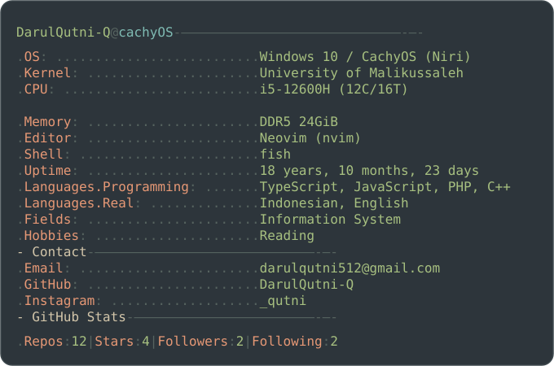

<table border="0">
<tr>
<td width="58%" valign="middle">
  
</td>
<td width="42%" valign="middle">

### `~ whoami`

```text
Darul Qutni
Sistem Informasi · Student · Developer 
```

<br/>


<br/>

[](https://instagram.com/_qutni)
[](mailto:darulqutni512@gmail.com)

</td>
</tr>
</table>
